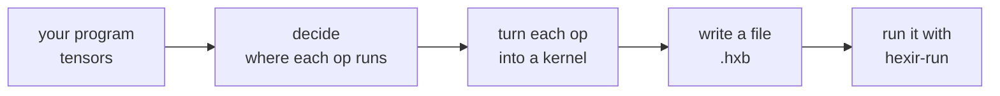

# Hexir

Hexir is a small compiler for neural networks. You give it a graph of
operations, it decides which ones run on the CPU and which on the GPU, and it
turns them into code you can run.

It is built on [MLIR](https://mlir.llvm.org/), and it is small enough to read.
That is the point: the gap between MLIR's Toy tutorial and a production
compiler like IREE is enormous, and Hexir sits in the middle.



To run a program, you compile it to a `.hxb` file and run it with `hexir-run`, a small program
that contains no compiler at all. A GPU kernel is compiled to a CUBIN and
embedded, so the runtime launches it with no compiler present.

## Start here

If you want to *use* it, read [Getting started](getting-started.md).

If you want to understand *how it works*, read [How it works](overview.md)
first. It is a picture and eight paragraphs. Then pick whichever of the
detailed pages you need.

## Where it stands

Hexir is research software. Some parts are finished and some are scaffolding,
and the docs say which is which rather than leaving you to find out.

| Works | Partly | Not yet |
| --- | --- | --- |
| CPU path, end to end | CPU kernels in `.hxb` are descriptions, not code | Fusion |
| GPU path, end to end | | Memory planning |
| Per-operation placement | | More operations, and a frontend |

```{toctree}
:hidden:
:maxdepth: 2
:caption: Using Hexir

getting-started
```
```{toctree}
:hidden:
:maxdepth: 2
:caption: How it works

overview
ir-levels
pipeline
runtime
```
```{toctree}
:hidden:
:maxdepth: 2
:caption: Optimizations

optimizations/overview
optimizations/graph
optimizations/kernel
optimizations/memory
optimizations/execution
optimizations/llm
```
```{toctree}
:hidden:
:maxdepth: 2
:caption: Reference

reference/cli
reference/dialects
reference/layout
cuda-server
```
