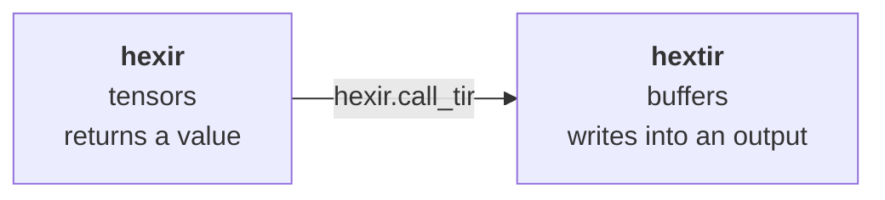

# The two IRs

Hexir defines two dialects of its own. Everything below them is standard MLIR.

| Dialect | Question it answers | Works on |
| --- | --- | --- |
| `hexir` | what to compute, and where | tensors |
| `hextir` | how one device computes it | buffers |

## hexir — the graph level

Whole-tensor operations with value semantics. No loops, no memory, no devices
yet.

```mlir
func.func @main() {
  %a = hexir.constant dense<[[3.0, 1.0], [2.0, 2.0]]> : tensor<2x2xf64>
  %b = hexir.constant dense<[[1.0, 5.0], [5.0, 2.0]]> : tensor<2x2xf64>
  %m = hexir.linear %a, %b : tensor<2x2xf64>
  %r = hexir.relu %m : tensor<2x2xf64>
  hexir.print %r : tensor<2x2xf64>
  return
}
```

After the placement pass, each operation carries where it runs:

```mlir
%m = hexir.linear %a, %b {device = "cuda"} : tensor<2x2xf64>
%r = hexir.relu %m {device = "cpu"} : tensor<2x2xf64>
```

Five operations lower end to end: `constant`, `linear`, `add`, `relu`,
`print`. Several more (`sigmoid`, `softmax`, `gelu`, `tanh`, and others) are
declared in TableGen but have no lowering — asking for one gives you a clear
error rather than wrong code.

## hextir — the kernel level

One device kernel, with the loops written out. Values are buffers (`memref`),
not tensors.

```mlir
hextir.prim_func @linear_0(%A: memref<2x2xf64>,
                           %B: memref<2x2xf64>,
                           %C: memref<2x2xf64>) attributes {device = "cpu"} {
  hextir.block "matmul" {
    hextir.for "parallel" %c0 to %c2 step %c1 {
    ^bb0(%i: index):
      hextir.for "parallel" %c0 to %c2 step %c1 {
      ^bb0(%j: index):
        hextir.buffer_store %zero, %C[%i, %j] : f64, memref<2x2xf64>
        hextir.for "serial" %c0 to %c2 step %c1 {
        ^bb0(%k: index):
          %x = hextir.buffer_load %A[%i, %k] : memref<2x2xf64> -> f64
          %y = hextir.buffer_load %B[%k, %j] : memref<2x2xf64> -> f64
          %acc = hextir.buffer_load %C[%i, %j] : memref<2x2xf64> -> f64
          %p = arith.mulf %x, %y : f64
          %s = arith.addf %acc, %p : f64
          hextir.buffer_store %s, %C[%i, %j] : f64, memref<2x2xf64>
        }
      }
    }
  }
  hextir.return
}
```

Three ideas are doing the work here.

**Destination passing.** A `prim_func` returns nothing. The last argument is
the buffer it writes into. This is how kernels work on real hardware, and it is
why the caller has to say what the result type is.

**The loop kind is the schedule.** `hextir.for` carries a `kind`: `serial`,
`parallel`, `vectorized`, `unrolled` or `thread_binding`. That one attribute
*is* the scheduling decision, so a scheduling pass rewrites an attribute rather
than restructuring the IR. Placement picks it:

```mlir
// device = "cpu"
hextir.for "parallel" %c0 to %c2 step %c1 { ... }

// device = "cuda"
hextir.for "thread_binding" %c0 to %c2 step %c1 bind "blockIdx.x" { ... }
```

Reduction axes (the `k` loop of a matrix multiply) stay `serial` on both,
because they cannot be run in parallel without more work.

**Blocks have names.** `hextir.block "matmul"` wraps the loop nest of one
computation. A scheduler can then say "tile block `matmul` by 32" instead of
pattern-matching on loop structure.

## The bridge between them

`hexir.call_tir` is the only way down from the graph level to the kernel level.



```mlir
%r = hexir.call_tir @linear_0(%a, %b)
     : (tensor<2x2xf64>, tensor<2x2xf64>) -> tensor<2x2xf64>
```

The two levels disagree on purpose. `hexir` works on tensors and *returns* a
result; a `prim_func` works on buffers and *writes* its result into a
destination. `call_tir` is where that gap is crossed: it names the result type
on the tensor side, and its verifier enforces the contract — the callee must
take one buffer per argument plus one more for the destination.

Get it wrong and you get told:

```text
error: 'hexir.call_tir' op expected @matmul to take 3 buffers
       (2 inputs + 1 destination), but it takes 2
```

## A third pair, on the way out

There are also `ls_cpu` and `ls_gpu` dialects: mirror-image `add`, `mul`,
`matmul` and `relu` ops that exist only to make placement visible in
`-emit=mlir-hetero`. They are a dead end. Every new operation has to be added
to *both* dialects plus two conversion patterns, and one has already been
forgotten — a program using `hexir.add` fails at `-emit=mlir-gpu` because
nothing converts `ls_cpu.add` back to linalg.

`hexir.call_tir` to a `prim_func` shows placement more concretely, so these are
expected to be deleted.
