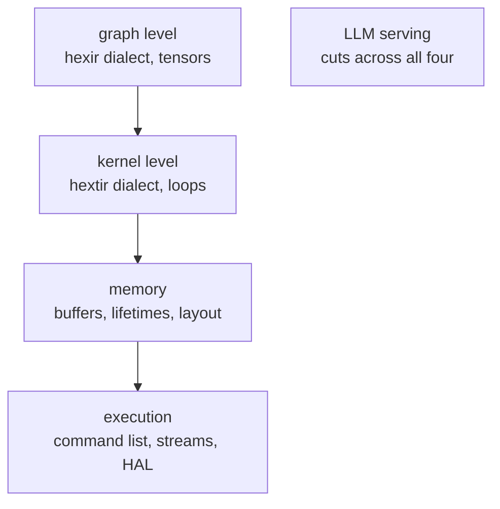
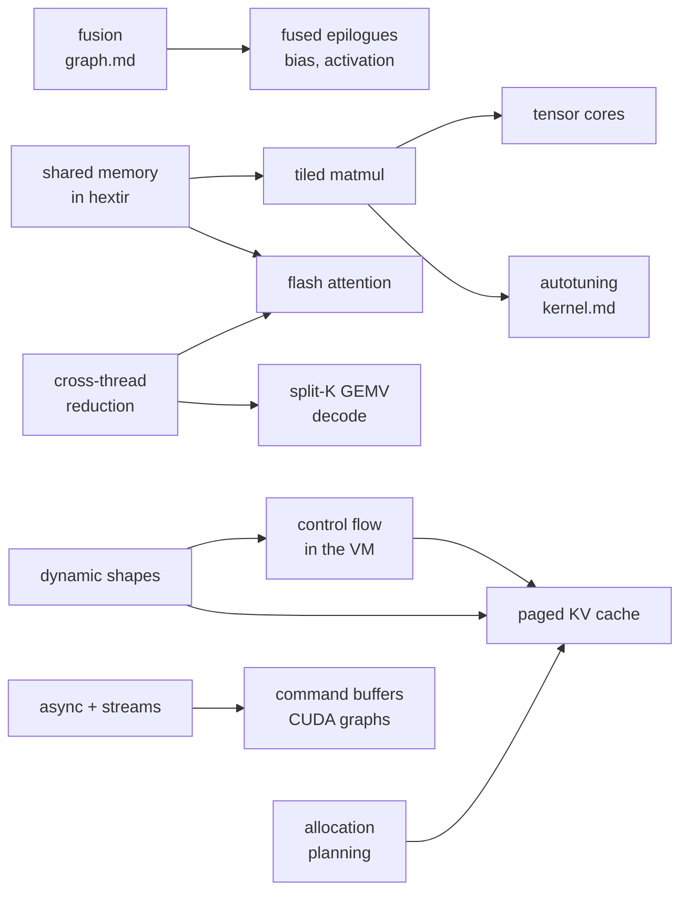

# What a fast compiler does

Hexir compiles a graph to code that runs. It does not yet compile it to code
that runs *fast*. This section is the catalogue of what would have to change,
drawn from the three compilers that have already solved most of it:
[TVM](https://tvm.apache.org/), [IREE](https://iree.dev/) and
[XLA](https://openxla.org/xla).

It is a reading list and a design space, not a plan. Every entry names the
prior art, what it buys, and where it would sit in Hexir. Nothing here is
implemented.

## The three lineages

They disagree about where optimization belongs, and the disagreement is the
useful part.

| | Where the schedule lives | How a kernel is chosen | Runtime |
| --- | --- | --- | --- |
| **TVM** | explicit, in the IR — a schedule is data you can print and mutate | searched, per shape, by a cost model | small graph executor or a VM |
| **IREE** | in target-specific codegen pipelines, driven by lowering configs | pattern-matched pipeline plus data tiling and microkernels | HAL with command buffers and timeline semaphores |
| **XLA** | implicit — fusion decisions plus an emitter, no user-visible schedule | fixed emitters, libraries, and autotuned Triton for GEMM | thunk sequence, optionally captured as a CUDA graph |

Hexir's `hextir` dialect already takes TVM's side: the loop `kind` attribute
*is* the schedule, visible in the IR
(see [The two IRs](../ir-levels.md)). That is the right foundation for most of
the kernel-level entries in this catalogue, and it is why the TVM column is
usually the closest match.

## Five levels, and the pages that cover them

The levels map onto Hexir's existing pipeline, so an entry in the catalogue
always has an obvious home.

* [Graph transforms](graph.md) — fusion, algebraic rewrites, layout,
  quantization, placement. Whole-tensor reasoning, before any loop exists.
  Relay/Relax in TVM, Flow in IREE, HLO in XLA.
* [Kernel transforms](kernel.md) — tiling, shared memory, vectorization,
  tensor cores, and the search that picks their parameters. TIR and
  MetaSchedule in TVM, LLVMGPU/LLVMCPU codegen in IREE, emitters and the
  Triton autotuner in XLA.
* [Memory](memory.md) — allocation planning, liveness, aliasing and in-place
  update, rematerialization, physical layout. `StorageRewrite` in TVM, the
  Stream dialect in IREE, `BufferAssignment` in XLA.
* [Execution](execution.md) — asynchrony, launch overhead, command buffers,
  multi-device transfer. Where a static graph stops paying per-dispatch costs.
* [LLM serving](llm.md) — paged KV cache, flash attention, weight-only
  quantization, decode-shaped kernels. Mostly *combinations* of the above, plus
  a few things that only make sense for autoregressive models.

## Where Hexir stands today

Worth stating plainly, because it decides what is worth reading first.

| Already present | Missing entirely |
| --- | --- |
| Placement as an op attribute, pre-lowering | Any fusion — one op becomes one kernel |
| A schedule attribute on every loop (`kind`) | Any use of `vectorized` or `unrolled`; both lower to a plain loop |
| Destination-passing at the kernel boundary | Shared memory, tiling, tensor cores |
| A device image embedded in the artifact | Buffer reuse; every intermediate is a fresh allocation |
| A flat, static command list | Asynchrony; every dispatch synchronizes |
| Constant folding of `hexir.constant` | Constant *evaluation* of subgraphs at compile time |
| f32 and f64 | Anything narrower, and any quantized format |

## Reading order, by dependency

Most of the catalogue is blocked on a handful of enabling changes. If you are
looking for where to start, start with the roots of this graph rather than the
leaves.

Three of those roots are prerequisites for almost everything on the
[LLM page](llm.md): shared memory in `hextir`, dynamic shapes in the
artifact format, and control flow in the VM. None of the three is an
optimization by itself, which is exactly why they are easy to defer and
expensive to defer.
