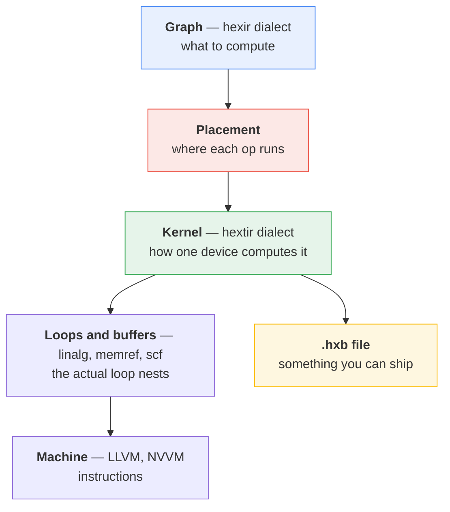
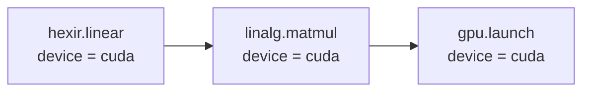

# How it works

A compiler is a stack of translations. Each level describes the same program,
but answers a different question about it.

## The five levels, one paragraph each

**Graph.** Your program as whole-tensor operations: a matrix multiply, a relu,
a print. No loops, no memory, no devices. This is the `hexir` dialect.

**Placement.** A pass walks the graph and writes a `device` attribute on every
operation, either `"cpu"` or `"cuda"`. It reads its decisions from a small
registry (`TargetSupport`) that you can override from the command line. This
happens *before* any lowering, so the decision travels down with the op.

**Kernel.** Each operation becomes a small function over buffers, with explicit
loops. This is the `hextir` dialect. Placement stops being a note here and
becomes real: a CPU op gets `parallel` loops, a GPU op gets loops bound to
`blockIdx.x` and `threadIdx.x`.

**Loops and buffers.** Standard MLIR from here: `linalg` for structured ops,
`memref` for buffers, `scf` for loops. Hexir does not invent anything at this
level because MLIR already has a good one.

**Machine.** LLVM IR for the CPU, NVVM then PTX then CUBIN for the GPU.

## Why placement comes first

The interesting question in this compiler is *where* things run, so the answer
is computed early and carried everywhere.

Every lowering pass copies the `device` attribute onto whatever it creates. So
by the time you reach GPU code generation, the ops that should become GPU
kernels are already labelled, and no pass has to guess.

The cost of this design is that the attribute can get dropped: a pass that
rebuilds an op without copying it loses the decision. That is why the partition
pass runs a second time, as a safety net for anything unlabelled.

## The two ways out

Once each operation is a kernel, the compiler can either finish the job itself
or hand you a file.

**Just run it** (`-emit=jit`). Lower all the way to LLVM IR and execute it in
this process. Fast to iterate on, but the compiler has to be present.

**Write a file** (`-emit=hxb`). Serialize the program into a `.hxb` module and
stop. `hexir-run` loads that file later. It links no MLIR and no LLVM, so it is
a few hundred kilobytes instead of a few hundred megabytes.

Both paths must produce the same numbers, and there is a test that diffs them
to make sure.

## What to read next

* [The two IRs](ir-levels.md) — what `hexir` and `hextir` actually look like
* [The pass pipeline](pipeline.md) — every pass, in order, and why
* [The runtime](runtime.md) — the file format and how it is executed
