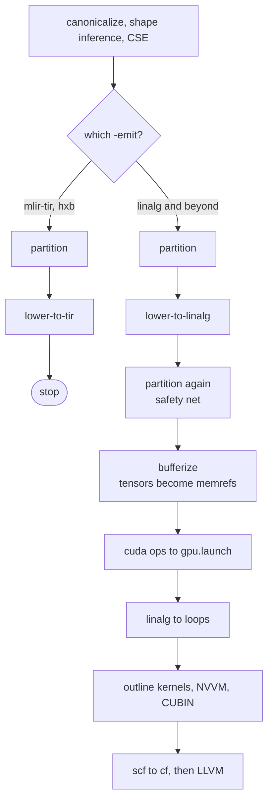

# The pass pipeline

All pass ordering lives in one function: `buildHexirPipeline` in
`compiler/Pipelines/Pipelines.cpp`. It adds passes and returns as soon as it reaches
the stage you asked for, and the driver runs the whole thing once.

## Why the order matters

The `Stage` enum is ordered, and the pipeline gates work with `>=` on it. Move
an entry and you change which passes run. Two consequences worth knowing:

* `Stage::TIR` sits *below* `Stage::Linalg`. That keeps
  `stage >= Stage::Linalg` false for `-emit=mlir-tir`, which is what makes the
  kernel level a branch off the pipeline rather than a step along it.
* Anything at or past `Stage::GPU` runs GPU lowering, including `llvm` and
  `jit`. That is deliberate: a JIT run of a CUDA-placed program has to compile
  the kernel.

## The passes

### Cleanup

`canonicalize` → `hexir-shape-inference` → `canonicalize` → `cse`.

Shape inference fills in result shapes through an interface each op
implements. It is nested on `hexir::FuncOp`, which only exists if the program
was built with `hexir.func` ops.

### Placement

`hexir-partition` writes `device = "cpu"` or `device = "cuda"` on each op,
reading from the `TargetSupport` registry in `compiler/Target/TargetInfo.cpp`. The
`-placement` flag overrides that registry before any pass runs.

It runs **before** lowering, so the decision can travel with the op. It skips
anything that already has a `device` attribute, which is what lets a second run
act as a safety net without overwriting real decisions.

### Kernel level

`hexir-lower-to-tir` turns each compute op into a `hextir.prim_func` plus a
`hexir.call_tir`, choosing loop kinds from the `device` attribute. Terminal —
nothing lowers `hextir` further yet.

### Graph to loops

`hexir-lower-to-linalg` rewrites `hexir.linear` into `linalg.matmul`,
`hexir.relu` into a `linalg.generic` with `arith.maximumf`, and constants into
`arith.constant`. Every pattern copies the `device` attribute onto whatever it
creates.

### Placement is visible without a detour

`-emit=mlir-hetero` prints linalg ops carrying their `device` attribute. Mirror
`ls_cpu` / `ls_gpu` dialects used to exist so placement appeared in the op name;
they were removed because the round trip through them rebuilt each op and lost
its destination operand and attributes.

### Bufferization

Tensors become buffers. Three things had to be right here, and each was a bug
at some point:

1. **`empty-tensor-to-alloc-tensor` must run first.** `tensor.empty` has no
   bufferization of its own, and the `alloc_tensor` created mid-flight never
   enters the worklist, so it survives as an unbufferized op.
2. **Do not use a constant as a destination.** A destination-passing `outs`
   operand must be writable. An `arith.constant` is not, so bufferization has
   to emit a read-only global plus a copy. Use `tensor.empty` and
   `linalg.fill`.
3. **Every tensor op needs a `BufferizableOpInterface`**, and for most dialects
   that comes from an external model you must register. `hexir.print` gets one
   from `compiler/Support/BufferizableOpInterfaceImpl.cpp`.

When this goes wrong you get `error: op was not bufferized` with no location.
Run with `--mlir-print-ir-after-failure` and look for what still has tensor
operands; `to_tensor` and `to_buffer` are allowed in the output, anything else
is the culprit.

### GPU

For ops with `device == "cuda"`, `hexir-lower-cuda-to-gpu` builds a
`gpu.launch` by hand. Then the standard chain: outline the kernel into a
`gpu.module`, attach the NVPTX target, convert to NVVM, compile to CUBIN with
`ptxas`, and rewrite the host side into CUDA runtime calls.

:::{warning}
The generated `gpu.launch` uses **one block and one thread**, and its body is a
sequential loop nest. It is correct but it is not fast — a single CUDA core
running a scalar loop loses to a CPU at any size. Making the kernel actually
parallel is the first thing to fix before measuring anything.
:::

### LLVM

`convert-linalg-to-loops` must run before GPU lowering finishes, because
`gpu-to-llvm` cannot handle live linalg ops. Then `scf` becomes control flow,
`hexir-to-llvm` lowers the remaining ops (including turning `hexir.print` into
`printf` calls), and unrealized casts are reconciled.
