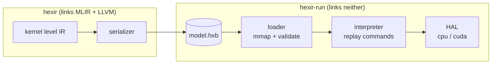

# The runtime

The compiler can hand you a file instead of running your program. The runtime
loads that file. It is plain C, and it links no MLIR and no LLVM — that is the
entire point. Deploying a compiled program should not mean shipping the
compiler.

```bash
./build/hexir -emit=hxb -o model.hxb mine.mlir   # compiler, ~230 MB
./build/hexir-run model.hxb                      # runtime, ~18 KB
```



## The file

A header, a table of sections, then the section contents:

```text
┌────────────────────────────────┐
│ header   magic, version, count │
├────────────────────────────────┤
│ section table                  │  kind, offset, size  x N
├────────────────────────────────┤
│ symbols       entry points     │
│ program       command list     │
│ rodata        weights          │
│ executables   kernel entries   │
└────────────────────────────────┘
```

Sections are found by absolute file offset, and the whole file is mapped with
`mmap`. Weights are read straight out of the mapping and never copied, so
loading a large model costs almost nothing. That single requirement is why
offsets are absolute and payloads are 8-byte aligned.

Offsets come off disk, so they are untrusted. Every one is bounds-checked
before a pointer is handed out — a section claiming to extend past the end of
the file is rejected, not followed.

## The program

The host program is a flat list of commands, not bytecode:

| Command | Meaning |
| --- | --- |
| `ALLOC` | make a zeroed buffer in a slot |
| `CONST` | bind a slot to constant data in `rodata` |
| `DISPATCH` | run a kernel on some slots |
| `PRINT` | print a slot as a matrix |
| `END` | done |

Buffers are referred to by *slot*, a small dense index the compiler assigns and
the runtime resolves to a real allocation.

There is no bytecode interpreter because there is nothing to interpret yet:
everything the compiler can currently produce is straight-line dataflow with no
control flow, so a list to replay is enough. Branches become necessary when
dynamic shapes or control flow arrive.

## The HAL

Everything device-specific sits behind one vtable, so the host program is
identical whether it ends up on a CPU or a GPU.

```c
hexir_device_create(kind, &device);
hexir_buffer_allocate(device, size, memory_kind, &buffer);
hexir_buffer_write(buffer, data, size);
hexir_buffer_read(buffer, data, size);
hexir_device_wait(device);
```

Buffers declare where they live — `HOST_LOCAL`, `DEVICE_LOCAL` or
`HOST_VISIBLE`. That distinction is where placement decisions show up at
runtime: a `DEVICE_LOCAL` buffer needs an explicit transfer, a `HOST_VISIBLE`
one does not.

Two backends exist. `cpu/` is malloc and memcpy. `cuda/` is real device memory
through the driver API: `cuMemAlloc`, `cuMemcpyHtoD`, `cuMemcpyDtoH`,
`cuCtxSynchronize`.

`libcuda` is **dlopened, never linked**, and the symbols are looked up by hand,
so the runtime still builds and runs on a machine with no CUDA at all — asking
for a CUDA device there fails with a message rather than failing to load. That
is also why the backend declares the few driver types it needs instead of
including `cuda.h`: no CUDA build dependency, only a runtime one.

```
$ hexir-run --selftest --device=cuda
device        : cuda (NVIDIA GeForce GTX 1660 Ti)
hal roundtrip : ok (32 bytes)
```

A CUDA buffer is `DEVICE_LOCAL`, so `hexir_buffer_host_pointer` returns NULL
and callers must use write/read. Those two calls **are** the host-to-device and
device-to-host transfers, which is why the artifact path gets transfers for
free where the JIT path does not.

## Placement is checked

A module records which device each kernel was compiled for. Running it
somewhere else is refused:

```text
hexir-run: kernel 'linear_0' is placed on cuda but the active device is cpu
```

Without that check a module built for the GPU would run quietly on the CPU and
print the right numbers, which is exactly the illusion this project exists to
avoid.

:::{note}
**A cuda kernel is real device code; a cpu kernel is still a description.**

For a kernel placed on cuda, `-emit=hxb` lowers it `hextir` → `gpu` → NVVM →
CUBIN and embeds the image. The module is then self-contained, and running it
needs a GPU and no compiler:

```
$ hexir -emit=hxb -o gpu.hxb -placement=hexir.linear=cuda
$ hexir-run --device=cuda gpu.hxb
device        : cuda (NVIDIA GeForce GTX 1660 Ti)
--
8.000000 17.000000
12.000000 14.000000
```

Identical to the CPU answer, which is the point: same program, same result,
different device, no compiler in the process.

Kernels are built with **bare-pointer calling convention**, so each argument is
one device address rather than MLIR's seven-scalar memref descriptor. That is
what keeps `cuLaunchKernel` in the runtime simple.

A cpu kernel still carries only a descriptor — kind, extents, placement — and
the runtime supplies the body from `reference_kernels.c`. Embedding a host
object would close that gap the same way, without changing the container.
:::

## Commands

```text
hexir-run <module.hxb> [--device=cpu|cuda] [--entry=name] [--quiet]
hexir-run --selftest
```

`--quiet`
: Print only the program's own output. Useful for diffing against the JIT.

`--selftest`
: Exercise the HAL — allocate, write, read back — without needing a module.

`--entry=name`
: Choose an entry point. Defaults to `main`.
